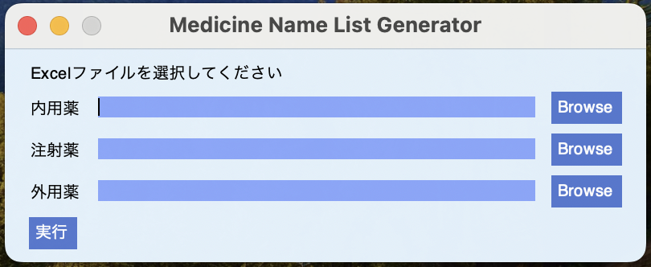

# CreateMedicineNameDataSet
[薬名暗記カード](https://tas5521.github.io/MedicineNameQuiz/index.html)のアプリで使用する薬名のデータセットを作成するプログラム

## データの引用元
元データは[厚生労働省のホームページ](https://www.mhlw.go.jp/topics/2024/04/tp20240401-01.html)から取得しました。

## 使用しているパッケージとバージョン
- pandas 2.0.1
- PySimpleGUI 4.60.5

## 使い方
### 事前準備
下記の二つのパッケージをインストールします。
- pandas
- PySimpleGUI

### 実行
1. IDLEで、medicine_name_list_generator.pyを開きます。 
2. RUN Moduleで実行します。適切に起動すれば下図のようなGUIが開きます。 
 
3. 「Browse」ボタンをクリックして、元データを読み込みます。 
サンプルデータは下記のとおりです。 
内用薬：Sample_oral.xlsx 
注射薬：Sample_injection.xlsx 
外用薬：Sample_topical.xlsx 
4. 全て読み込んだら、「実行」ボタンをクリックします。 
適切に実行されると、medicine_name_list_generator.pyと同じディレクトリにCSVファイルが生成されます。 